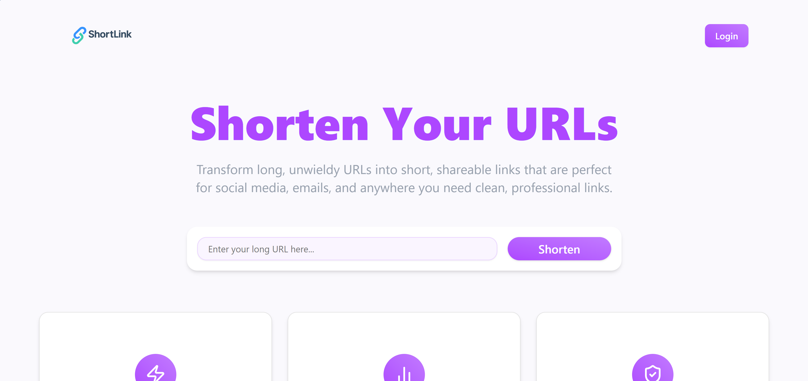
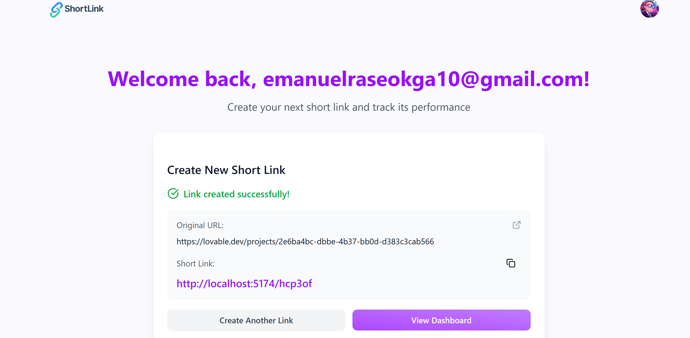
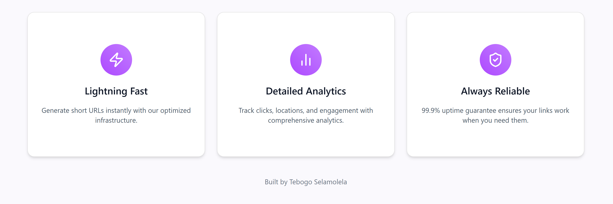
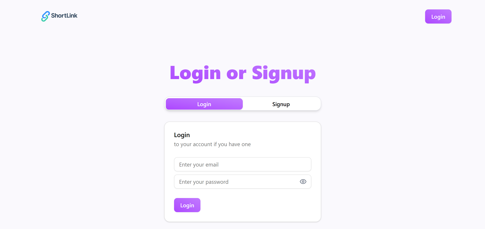
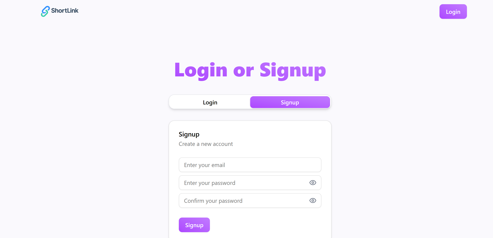
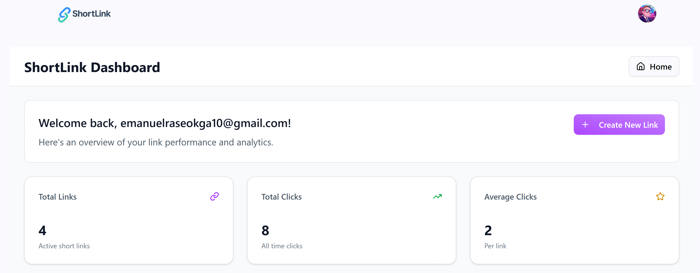
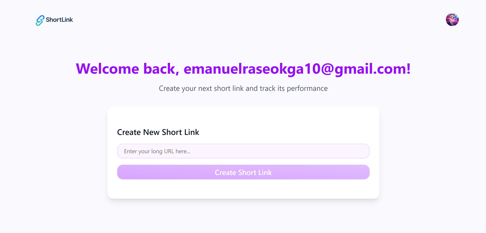

# ShortLink - URL Shortener

A modern, real-time URL shortening application built with React, Vite, and Supabase.

## 🚀 Quick Start (For Non-Technical Users)

**To run this application, you only need Docker Desktop installed on your computer.**

### 📋 Prerequisites:
- **Docker Desktop** must be installed and running
- **Windows/Mac/Linux** - works on all operating systems

### 🎯 Step-by-Step Instructions:

1. **📁 Extract the zip file** to a folder on your computer
2. **📂 Open the extracted folder** (you should see files like `docker-compose.yml`, `README.md`, etc.)
3. **🖱️ Right-click in the folder** while holding `Shift` key
4. **📝 Select "Open PowerShell window here"** or "Open command window here"
5. **⌨️ Type this command and press Enter:**
   ```bash
   docker-compose up
   ```
6. **⏳ Wait for it to finish loading** (you'll see lots of text scrolling)
7. **🌐 Open your web browser** and go to: `http://localhost:3000`

**✅ Success!** The application is now running and accessible.

### 🛑 To Stop the Application:
- **Press `Ctrl+C`** in the terminal window
- **Or close the terminal window**

### 🆘 If Something Goes Wrong:
- Make sure **Docker Desktop is running**
- Try running the command again
- Check that you're in the correct folder

## Features

- ✅ **Real-time URL shortening** - Create short links instantly
- ✅ **Click tracking** - Track clicks on your shortened links
- ✅ **Real-time analytics** - Beautiful line charts showing click trends
- ✅ **User authentication** - Secure login and signup with Supabase
- ✅ **Dashboard** - Manage all your links in one place
- ✅ **Copy functionality** - Easy copying of short links
- ✅ **Responsive design** - Works on all devices

## Screenshots

### 🏠 Homepage & Navigation

*Clean navigation with logo and authentication*


*Main URL shortening functionality with modern form design*


*Feature highlights and call-to-action sections*

### 🔐 Authentication System

*Secure login form with password visibility toggle*


*User registration with form validation*

### 📊 Dashboard & Analytics

*Comprehensive dashboard with welcome message and link management*


*Real-time analytics with beautiful line charts showing click trends*

### 👤 User Experience

*Personalized experience for authenticated users with direct link creation*

## Development Setup

1. **Clone the repository**
   ```bash
   git clone <repository-url>
   cd Pot-Strategy
   ```

2. **Install dependencies**
   ```bash
   npm install
   ```

3. **Set up environment variables**
   Create a `.env` file in the root directory:
   ```
   VITE_SUPABASE_URL=your_supabase_url
   VITE_SUPABASE_ANON_KEY=your_supabase_anon_key
   ```

4. **Set up database**
   Run this SQL in your Supabase SQL Editor:
   ```sql
   CREATE TABLE links (
     id UUID DEFAULT gen_random_uuid() PRIMARY KEY,
     user_id UUID REFERENCES auth.users(id) ON DELETE CASCADE,
     original_url TEXT NOT NULL,
     short_code TEXT UNIQUE NOT NULL,
     clicks INTEGER DEFAULT 0,
     is_active BOOLEAN DEFAULT true,
     created_at TIMESTAMP WITH TIME ZONE DEFAULT NOW(),
     last_clicked_at TIMESTAMP WITH TIME ZONE
   );

   ALTER TABLE links ENABLE ROW LEVEL SECURITY;

   CREATE POLICY "Users can view their own links" ON links
     FOR SELECT USING (auth.uid() = user_id);

   CREATE POLICY "Users can insert their own links" ON links
     FOR INSERT WITH CHECK (auth.uid() = user_id);

   CREATE POLICY "Users can update their own links" ON links
     FOR UPDATE USING (auth.uid() = user_id);
   ```

5. **Start development server**
   ```bash
   npm run dev
   ```

## Production Deployment

### For Production, update the base URL:

1. **Add environment variable** in your production environment:
   ```
   VITE_BASE_URL=https://yourdomain.com
   ```

2. **Or update the config** in `src/config.js`:
   ```javascript
   baseUrl: 'https://yourdomain.com'
   ```

### Deployment Options:
- **Docker** - Containerized deployment (recommended)

## How It Works

1. **Create Link** - User enters a long URL and gets a short code
2. **Share Link** - User copies the short link (e.g., `yourdomain.com/abc123`)
3. **Click Tracking** - When someone visits the short link, it redirects and tracks the click
4. **Analytics** - Dashboard shows real-time click analytics and trends

## Deployment Notes

- **Docker Deployment**: Containerized application ready for easy deployment
- **Dashboard Functionality**: All dashboard features work perfectly including link creation and analytics
- **Direct Link Access**: Short links work when accessed from the dashboard. For direct URL access, the Docker setup handles SPA routing properly.

## Tech Stack

- **Frontend**: React, Vite, TailwindCSS
- **Backend**: Supabase (Database, Auth, Real-time)
- **UI Components**: Shadcn UI
- **Charts**: Custom SVG line charts
- **Deployment**: Docker

## Visual Documentation

The app includes comprehensive visual documentation with screenshots showing:
- **User Interface**: Clean, modern design with purple gradient theme
- **Functionality**: Real-time features, analytics, and user management
- **Responsive Design**: Mobile-first approach with touch-friendly interactions
- **Professional Polish**: Toast notifications, loading states, and smooth animations

See the `screenshots/` directory for detailed capture instructions.
